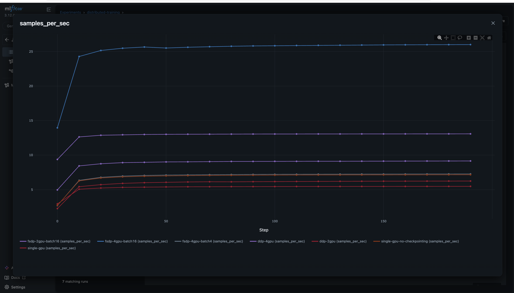
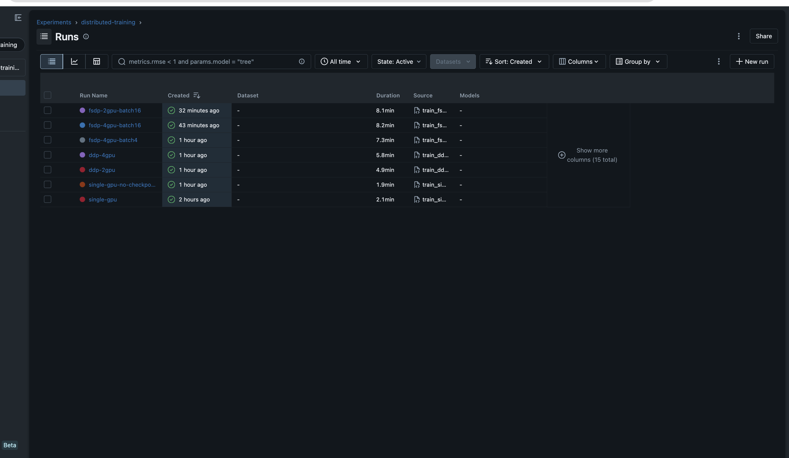

# distributed-llm-training

Fine-tune Llama-3-8B across multiple GPUs. Benchmark Single GPU → DDP → FSDP → Ray Train on real hardware. Every number measured, every failure documented.





---

## The Problem

Four things live in GPU HBM during training:

| What | Size |
|------|------|
| Weights | 16GB (8B params × 2 bytes BF16) |
| Gradients | 16GB (same shape as weights) |
| Optimizer states | 32GB (AdamW: momentum + variance) |
| Activations | varies |

**Total: 64GB+ before activations.** A single 24GB GPU cannot run full fine-tuning. Each stage is a response to that constraint.

---

## Phase 1 — OOM Story (4× RTX 4090, 24GB, Vast.ai)

Intentionally hit every failure mode before solving it.

| Attempt | Result | Root Cause |
|---------|--------|------------|
| Single GPU | OOM (forward) | Activations alone fill 24GB |
| Single GPU + grad checkpointing | OOM (optimizer.step) | AdamW states created lazily: +32GB on first step |
| DDP 4 GPU | OOM (init) | Gradient bucket pre-allocated = model size. 32GB before step 0 |
| FSDP (hardcoded import) | 22GB/rank, no sharding | `isinstance()` failed on newer transformers |
| FSDP (runtime detection) | OOM (backward) | Sharding worked but activations still 13GB/rank |
| FSDP + grad checkpointing | loss NaN | FP16 overflow: SiLU → inf × 0 = NaN |
| FSDP + BF16 | ✓ stable | BF16 has same exponent range as FP32 |
| Ray Train | OOM (init) | Wraps DDP — same gradient bucket problem |

**4 GPUs + FSDP + BF16 + gradient checkpointing is the minimum that fits on 24GB.**

---

## Phase 2 — Benchmarks (4× RTX PRO 6000, 96GB, PCIe 5.0, Vast.ai)

With enough HBM, measure what actually matters.

### Stage 1 — Single GPU: Activation Memory

Gradient checkpointing discards activations during forward, recomputes during backward.

| Run | samples/sec | steady_mb | fwd_peak_mb | activation_mb |
|-----|-------------|-----------|-------------|---------------|
| ckpt ON  | 6.25 | 61783 | 49549 | 3082 |
| ckpt OFF | 7.16 | 61783 | 62421 | 15954 |
| saved    | −14.6% throughput | — | 12872MB | **80.7% less activations** |

Steady memory is identical — activations are freed before `optimizer.step()`. `fwd_peak` is the real ceiling. Checkpointing cuts activation memory by 80.7% at a 14.6% throughput cost.

---

### Stage 2 — DDP: Throughput Scaling

Every rank holds the full model. No memory savings — only throughput gain from parallel compute. All-reduce synchronizes gradients after every backward over PCIe 5.0 (54GB/s).

Baseline: 6.25 samples/sec (measured single GPU — not spec sheet numbers).

| Run | GPUs | samples/sec | Expected | Efficiency |
|-----|------|-------------|----------|------------|
| DDP | 2 | 5.48 | 12.50 | 43.8% |
| DDP | 4 | 9.16 | 25.00 | 36.6% |

**2 GPU DDP is slower than single GPU.** All-reduce over PCIe costs more time than parallel compute gains. At 4 GPUs, compute wins — but only 1.47× despite paying for 4×. Efficiency drops as GPUs are added because all-reduce rounds grow while PCIe bandwidth stays fixed.

On NVLink (600GB/s) the same workload hits 85%+ efficiency — 11× faster interconnect is the difference.

---

### Stage 3 — FSDP: Memory Sharding + Throughput Recovery

Shards weights + gradients + optimizer states across GPUs. Each rank holds ~1/N of everything.

| Run | GPUs | Batch | samples/sec | steady_mb/rank | vs DDP 4GPU |
|-----|------|-------|-------------|----------------|-------------|
| FSDP | 4 | 4  | 7.26  | 15837 | 0.79× (apples-to-apples) |
| FSDP | 4 | 16 | 26.01 | 17339 | **2.84×** |
| FSDP | 2 | 16 | 13.09 | 32653 | **1.43× at half the cost** |

Memory drop: 77099MB (DDP) → 15837MB (FSDP) per rank — **75% reduction**.

FSDP batch=4 is slower than DDP — 64 communication rounds per step vs DDP's 1 all-reduce. But FSDP freed 75% of HBM. That freed space fits batch=16. Communication cost is fixed per step — same overhead, 4× more samples. **FSDP batch=16 beats DDP 4 GPU in throughput on the same hardware.**

**The cost argument:** GPU hours cost money, techniques don't. FSDP 2 GPU at $2.10/hr beats DDP 4 GPU at $4.205/hr in both throughput and cost.

---

### Stage 4 — Ray Train: Managed DDP

| Run | GPUs | samples/sec | vs DDP 4GPU |
|-----|------|-------------|-------------|
| Ray Train | 4 | 9.07 | ~same |

Ray Train wraps DDP — same memory, same communication, same throughput. What changes: no manual `dist.init_process_group`, no `MASTER_ADDR`/`MASTER_PORT`, multi-node coordination automatic.

---

## How to Run

```bash
# Single GPU
python train_single.py
python train_single_no_ckpt.py

# DDP
torchrun --nproc_per_node=2 train_ddp.py
torchrun --nproc_per_node=4 train_ddp.py

# FSDP
torchrun --nproc_per_node=4 train_fsdp.py --batch_size 4
torchrun --nproc_per_node=4 train_fsdp.py --batch_size 16
torchrun --nproc_per_node=2 train_fsdp.py --batch_size 16

# Ray Train
python train_ray.py

# Compare all results
python compare_runs.py
```

MLflow (SSH with `-L 8080:localhost:8080`):
```bash
mlflow server --host 0.0.0.0 --port 8080
```

---

## Stack

- PyTorch 2.2+ — DDP, FSDP
- HuggingFace Transformers + Datasets — Llama-3-8B, Alpaca
- MLflow — experiment tracking
- Ray Train — managed distributed training
- Vast.ai — 4× RTX 4090 24GB (Phase 1), 4× RTX PRO 6000 96GB PCIe 5.0 (Phase 2)

**Dataset:** Alpaca 52k instruction-response pairs. Response-only loss masking — loss on response tokens only, instruction tokens masked to `-100`.
